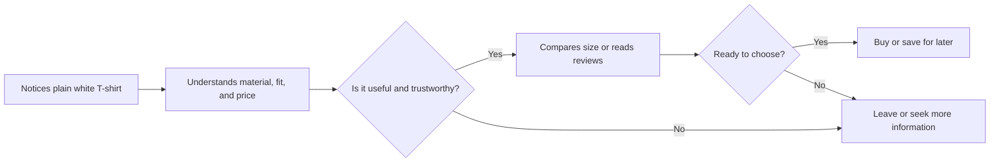

# Chapter 1: Persuasion

Persuasion is the ethical practice of helping people notice something, make sense of it, trust it, and decide what to do next. It appears in advertising, presentations, product pages, public-health messages, and ordinary conversations. It is not magic: people still have their own needs, experiences, and right to say no.

For a designer or brand, persuasion can shape four things:

- **Attention:** What does a person notice first?
- **Interpretation:** What does the product or message seem to mean?
- **Trust:** Why should the person believe the claim or source?
- **Action:** What is a reasonable next step, such as learning more, trying, buying, or declining?

## Persuasion, Coercion, and Manipulation

Persuasion gives people understandable reasons and leaves them free to choose. Coercion uses force, threats, or penalties that make a real choice difficult or impossible. Manipulation hides important information, exploits confusion or vulnerability, or pressures someone toward an outcome that mainly benefits the persuader.

For example, a store can persuade a shopper to consider a plain white T-shirt by clearly explaining that it is durable, pre-shrunk, and easy to layer. It becomes manipulative if it claims “only two left” when stock is plentiful, or hides a recurring membership charge until checkout.

The same technique can be ethical or unethical depending on the facts, the audience, and whether the person can make an informed choice. A useful test is simple: would the message still seem fair if the customer understood exactly how it was designed to influence them?

## Cialdini's Principles of Influence

Psychologist Robert Cialdini described recurring patterns that can make a request or message more persuasive. These principles describe tendencies, not buttons that control people. They work best when they match a real benefit and are communicated honestly.

- **Reciprocity:** People often want to return a genuine favor. A useful sizing guide may make a shopper more willing to consider the brand later.
- **Commitment and consistency:** After people make a small, voluntary choice, they often prefer later choices that fit it. Someone who saves a white T-shirt to a wish list may be more open to comparing sizes.
- **Social proof:** When uncertain, people look at what similar people do or value. Verified reviews can help shoppers understand whether a shirt fits as described.
- **Authority:** People give extra attention to credible expertise. A textile-care specialist can explain why a particular fabric blend is easy to wash.
- **Liking:** We are more open to people and brands we find relatable, friendly, or similar to us. Clear, respectful copy can make a brand easier to engage with.
- **Scarcity:** Limited availability can make an opportunity feel more valuable. It is appropriate to say that a limited seasonal color is nearly sold out only when that is true.
- **Unity:** Shared identity can strengthen influence. A campus organization might present its white T-shirt as a way for members to show belonging, without suggesting nonmembers are inferior.

## Two More Useful Ideas

### Framing changes interpretation

Framing is the way information is presented. It does not have to change the facts. The same white T-shirt can be framed as a “reliable everyday layer,” a “blank canvas for screen printing,” or a “minimal wardrobe staple.” Each description directs attention toward a different use and audience.

Ethical framing selects relevant truths; it does not turn a limitation into a false advantage. If the shirt is thin, calling it “lightweight” can be fair when the weight is stated clearly. Calling it “premium heavyweight” would not be.

### Cognitive ease affects decisions

People are more likely to continue when information feels clear and manageable. This is sometimes called cognitive ease. A product page can support it with readable size information, a plain explanation of returns, and one clear next action. It should not use complexity to make an unwanted choice hard to avoid.

For the T-shirt, “100% cotton; relaxed fit; see size chart; free returns within 30 days” is easier to evaluate than vague, crowded copy. Clarity helps a customer decide; it does not decide for them.

## A Practical Comparison

| Principle or idea | Mechanism | Ethical use | Misuse risk |
| --- | --- | --- | --- |
| Reciprocity | A real favor can create goodwill. | Offer a useful fabric-care guide with no hidden obligation. | Making a “free” gift feel like a debt the customer must repay. |
| Commitment and consistency | Small voluntary choices can lead to related choices. | Let shoppers save a shirt and return later. | Turning an email sign-up into repeated, unwanted pressure. |
| Social proof | People use others' experiences when uncertain. | Show genuine, relevant, verified reviews. | Buying reviews or showing misleading popularity counts. |
| Authority | Credible expertise can increase trust. | Use a qualified source for care or materials advice. | Pretending an influencer or logo is independent expertise. |
| Liking | Connection and similarity can make a message easier to hear. | Write warmly and represent customers respectfully. | Using false friendship or parasocial pressure to push a sale. |
| Scarcity | Limited supply or time can increase urgency. | State a real production limit or sale end date. | Inventing countdowns, stock limits, or urgency. |
| Unity | Shared identity can encourage cooperation and belonging. | Invite a group to wear a shirt for a real shared event. | Treating belonging as a reason to shame or exclude people. |
| Framing | Presentation directs attention to particular meanings. | Describe the shirt as a practical layering option for that audience. | Highlighting a benefit while hiding a material limitation. |
| Cognitive ease | Clear information reduces unnecessary mental effort. | Make price, sizing, and returns easy to find. | Making cancellation or comparison deliberately confusing. |

## A Simple Decision Journey

Notice that the journey includes leaving. Ethical persuasion makes a good decision easier, even when the good decision is not to buy.

## Questions to Ask Before Trying to Persuade

- What decision am I asking this person to make?
- What real benefit does this offer them, not just the brand?
- Are the important facts, costs, limits, and alternatives clear?
- Could someone reasonably say no without being punished, trapped, or embarrassed?
- Am I using evidence that is accurate and relevant to this audience?
- Would I be comfortable explaining this approach openly to the people affected by it?

## Explore Further

If you want to research these ideas, search for:

- `Robert Cialdini principles of influence reciprocity social proof`
- `ethical persuasion versus manipulation design`
- `framing effect psychology examples`
- `cognitive ease communication design`

## What You Should Remember

Persuasion helps people pay attention, interpret information, build trust, and choose an action. It is different from coercion and manipulation because it respects informed, voluntary choice. Cialdini's principles, framing, and cognitive ease can make communication more effective, but ethical use requires accurate claims, clear choices, and respect for the audience.
