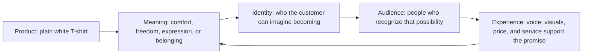

# Chapter 2: Brand Archetypes

A brand archetype is a practical framework for giving a product, organization, or experience recognizable meaning. It uses broad cultural and narrative patterns—such as the explorer, the caregiver, or the rebel—to help a brand make consistent choices about its voice, images, promises, and customer experience.

The important question is not simply, “Which archetype are we?” It is:

> What does the audience get to feel, imagine, or become by choosing this brand?

A plain white T-shirt is physically simple. Yet it can mean independence, comfort, craftsmanship, belonging, or even disruption depending on how it is presented. The shirt has not changed; the story and experience around it have.

## Archetypes Are Not Destiny

Archetypes are models, not literal personality diagnoses. A brand is not a person, and customers are not limited to one kind of identity. These labels are useful because they make a vague idea—such as “we want to feel bold but approachable”—easier to discuss and design.

Most brands contain more than one tendency. An outdoor company might combine Explorer energy with Caregiver responsibility. A university could communicate Sage expertise while also using Everyperson language to welcome new students. Cultural context also matters: an image, joke, symbol, or idea of authority may carry different meanings for different communities.

Use archetypes as a starting point for asking better questions, not as a box that forces everyone to behave the same way.

## A Useful Set of Common Archetypes

The following archetypes are common in brand strategy. They are not a complete list, and no one label guarantees a successful brand.

| Archetype | Core desire or promise | Typical feeling | Plain white T-shirt position |
| --- | --- | --- | --- |
| Explorer | Freedom, discovery, and self-direction | Open, adventurous | A durable base layer for a day of wandering or travel. |
| Sage | Understanding and truth | Informed, confident | Clearly labeled materials, construction, and care facts. |
| Creator | Original expression and making | Imaginative, capable | A blank shirt made for painting, printing, or customizing. |
| Ruler | Control, quality, and status | Assured, polished | A precisely cut essential for a carefully organized wardrobe. |
| Caregiver | Help, safety, and support | Reassured, cared for | A soft, dependable shirt sold with clear fit and return support. |
| Rebel | Liberation and challenging convention | Defiant, independent | An unbranded blank that rejects loud logos and fashion rules. |
| Hero | Courage, achievement, and improvement | Strong, motivated | A hard-wearing training shirt for working toward a goal. |
| Everyperson | Belonging, practicality, and equality | Comfortable, included | An affordable, straightforward tee for everyday life. |
| Innocent | Simplicity, optimism, and safety | Calm, hopeful | A clean, uncomplicated shirt with gentle, simple presentation. |
| Jester | Fun, play, and living in the moment | Amused, energized | A shirt paired with playful styling or an unexpected message. |
| Lover | Connection, beauty, and sensory pleasure | Warm, desired | A soft, close-fitting tee presented as a thoughtful personal gift. |
| Magician | Transformation and possibility | Inspired, surprised | A basic white tee shown as the beginning of a new look or creative ritual. |

## One Product, Different Meanings

Here are four ways to position the identical plain white T-shirt. Each version should be supported by real product details; the story cannot honestly promise what the shirt does not deliver.

### 1. Explorer: “Pack Light. Go Far.”

The product page shows the shirt folded in a small travel bag and explains its practical benefits, such as easy layering and simple care. The audience gets to imagine themselves as self-reliant and ready to go somewhere new. The visual style might use open space, route-like graphics, and direct language.

### 2. Creator: “Start With a Blank Canvas.”

The same shirt is presented beside fabric paint, screen-printing tools, or sketches. The promise is not that wearing it makes someone artistic; it is that the shirt gives them a simple surface for their own work. The audience gets to feel expressive and capable of making something personal.

### 3. Everyperson: “The Tee That Fits Real Life.”

This position emphasizes comfort, accessible information, and everyday situations: class, errands, laundry day, or relaxing with friends. The audience gets to feel included rather than judged for not having an expert fashion vocabulary. Images should show a range of ordinary people and uses, not one exclusive ideal.

### 4. Rebel: “No Logo. No Rules.”

The shirt is framed as a response to over-branded clothing. Minimal packaging and blunt copy support an independent point of view. The audience gets to imagine stepping away from pressure to display a label. This only works ethically if the company does not secretly rely on false scarcity or another form of status signaling.

These versions use the same physical item, but they invite different interpretations. Positioning is therefore more than a slogan: it shapes product photography, copy, packaging, customer service, and the choices a brand makes over time.

## From Product to Audience

The loop matters. If the experience contradicts the meaning—for example, a brand promises everyday inclusion but makes returns confusing—the archetype becomes empty decoration.

## How to Use an Archetype Without Becoming Repetitive

An archetype should guide choices, not produce a costume. A Creator brand does not need paint splatters on every page. Instead, it might offer customization tools, feature customer projects with permission, and write copy that invites experimentation. A Sage brand does not need to sound formal all the time; it can earn trust through clear explanations and honest limits.

Look for evidence in the whole experience:

- Is the promise visible in the product, not only in the tagline?
- Do photographs, language, pricing, and service tell a compatible story?
- Is the identity being invited rather than imposed on the audience?
- Does the message respect differences in culture, ability, income, and experience?

## Questions to Ask When Choosing an Archetype

- What need, hope, or tension does this product honestly address?
- What should a customer feel, imagine, or become after choosing us?
- Which archetype best fits the product's real strengths and the audience's context?
- Are we combining two archetypes, and if so, which one leads?
- How will this idea appear in the voice, visuals, product details, and service?
- Could this framing stereotype, exclude, or misunderstand part of the audience?
- What evidence would show that customers actually understand the intended meaning?

## What You Should Remember

Brand archetypes are shared story patterns that help a product carry recognizable meaning. They are not fixed personality types or a substitute for research. A plain white T-shirt can support Explorer, Creator, Everyperson, Rebel, and many other positions when the surrounding promise is honest and the customer experience supports it. The best archetype gives an audience a believable way to feel, imagine, or become something meaningful.
