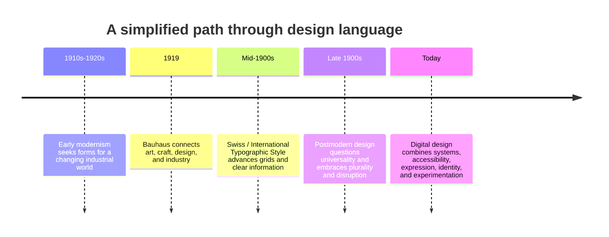

# Chapter 3: Design Language

Visual design carries ideas before a reader has time to analyze every word. A grid can suggest order. A crowded page can suggest energy or overload. A sober typeface can imply authority, while an exaggerated one can signal play, protest, or performance. These meanings are not automatic or universal, but design traditions give us useful ways to read the choices behind them.

## A Short Path into Modernism

Early twentieth-century modernism grew alongside rapid industrialization, new materials, mass production, and new ways of living in cities. Many designers wanted forms that suited a changing world instead of copying historical decoration. They looked for clarity, useful structure, and visual systems that could work across many situations.

The **Bauhaus**, a German school founded in 1919, became an important site for connecting art, craft, design, and industry. Its teachers and students explored how materials, geometry, typography, and production could work together. It was not one single look, but its legacy is often associated with experimentation, functional thinking, and the relationship between design and everyday life.

Later, the **Swiss / International Typographic Style** developed especially strongly in the mid-twentieth century. It emphasized asymmetric layouts, grid systems, sans-serif typography, photography, and clear information. Its designers aimed to make communication legible and systematic across languages, products, and public settings.

## Modernist Design Principles

Modernism is broad and varied, but several principles often appear in modernist visual language:

- **Grid:** An underlying structure aligns elements and creates relationships.
- **Hierarchy:** Size, position, contrast, and spacing show what to read first.
- **Clarity:** Information is easy to locate and understand.
- **Reduction:** Unnecessary decoration is removed so important elements can stand out.
- **Function:** A visual decision should support a purpose, such as reading, navigating, comparing, or using an object.

These principles can be powerful. A transit map, medical form, or checkout page benefits when a person can understand it quickly. But clarity does not mean every design must look neutral, and no visual system is completely free of cultural assumptions.

## Postmodernism: A Reaction and an Expansion

Postmodern design developed partly in reaction to modernism's claims of certainty, restraint, universality, and order. Rather than assuming one clean system could serve every audience and situation, postmodern designers often embraced **plurality**, **irony**, **disruption**, **quotation**, and **expressive typography**.

Quotation means borrowing or referring to recognizable visual languages, such as a historical type style, a commercial sign, or a familiar layout. Irony can make a design comment on its own seriousness or on the culture around it. These approaches can expose whose idea of “universal” has been treated as normal. They can also become empty noise when disruption makes information difficult to use without adding meaning.

Postmodernism did not erase modernism. It made the tension more visible: should design feel orderly or disruptive, universal or identity-specific, clear or expressive, gridded or anti-grid, restrained or abundant, functional or ironic?

## The Tension Is Still Present Online

Contemporary web and product design uses both traditions, often in the same interface. A banking app may use a calm grid, familiar buttons, and a clear sequence because users need confidence when moving money. A music or fashion campaign may layer large type, animation, collage, and surprising interaction to create a more expressive identity.

Even a highly expressive site still needs usable navigation, readable text, and accessible contrast. Likewise, a clean interface is never merely technical: its choices about images, language, and default settings can communicate who it thinks belongs. The goal is not to choose a historical “winner.” The goal is to match form to audience, purpose, and context.

| Tension | Modernist tendency | Postmodern tendency | Contemporary digital example |
| --- | --- | --- | --- |
| Order and disruption | Predictable alignment and sequence | Intentional interruption or collision | A checkout flow uses steady steps; a campaign landing page may animate elements unexpectedly. |
| Universality and identity | A shared system intended to work broadly | Visible local, cultural, or group-specific references | A platform uses common controls but lets communities set their own visual voice. |
| Clarity and expression | Readability and direct information | Type and image also perform mood or attitude | A news article favors readable columns; a concert page uses oversized display type. |
| Grid and anti-grid | Consistent columns and spacing | Overlap, irregular placement, or broken alignment | A dashboard follows a grid; an editorial portfolio may intentionally let images overlap. |
| Restraint and abundance | Limited colors, typefaces, and elements | Layering, collage, pattern, and mixed references | A settings screen stays sparse; a game launch page may be visually dense. |
| Function and irony | Form supports a practical task | Form can question, parody, or comment on conventions | A help page speaks plainly; a playful brand error page may use a self-aware message. |

## A Continuing Conversation

This timeline is a learning map, not a list of styles that cleanly replaced one another. Ideas overlap, travel, and change in different places.

## The Same White T-Shirt, Two Design Languages

A modernist presentation of a plain white T-shirt might use a white or neutral background, a precise grid, one sans-serif typeface, a clear price, a straightforward size chart, and a carefully lit product photograph. The shirt feels dependable, considered, and easy to evaluate.

A postmodern presentation could use overlapping images, several contrasting type styles, bright color, a playful slogan, or references to different subcultures. The same shirt feels like a statement or a piece of a larger scene. Neither approach changes the cotton, cut, or color. The design changes what the audience notices and what the shirt seems to stand for.

The ethical requirement remains the same: expressive presentation must not hide the real material, price, fit, or return conditions.

## How to Read a Design

When you encounter a poster, webpage, app, package, or product page, pause before deciding whether you “like” it. Ask:

- What do I notice first, second, and last? How is hierarchy directing me?
- Where is the grid or organizing structure? If there is no obvious grid, what replaces it?
- Which type, color, image, and spacing choices suggest a mood or identity?
- Is the design prioritizing quick understanding, expression, or both?
- What cultural references or visual quotations does it use?
- Who might feel welcomed, confused, excluded, or represented by these choices?
- Does the visual style support the task the user needs to complete?

## Museum Research

Use museum and institutional collections to find authentic objects and verify their details yourself. Do not rely only on reposts, image boards, or unsourced social-media captions.

Start by visiting the collection search pages of institutions such as The Metropolitan Museum of Art, the Museum of Modern Art (MoMA), Cooper Hewitt, the Victoria and Albert Museum (V&A), and Bauhaus archives. Search for terms such as:

- `Bauhaus typography poster`
- `International Typographic Style poster`
- `Swiss graphic design grid`
- `postmodern graphic design typography`
- `modernist textile design`

For each object you choose, verify the title, maker, date, medium, and collection record directly on the institution's site. Then write down what you can actually observe: alignment, type, color, material, imagery, and intended use. Separate those observations from your interpretation of what the design might communicate.

## What You Should Remember

Design language is a way visual choices communicate ideas. Modernist traditions often value grid, hierarchy, clarity, reduction, and function. Postmodern approaches question a single universal order and make room for plurality, irony, disruption, quotation, and expression. Contemporary digital design still works through these tensions. Read the choices carefully, connect them to purpose and audience, and verify historical examples through credible collections.
